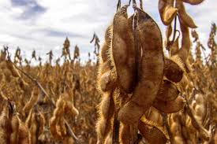

# Olá, meu nome é Lucas Pereira Belo 👋

  <em>Atualmente sou doutorando em Estatística Aplicada e Biometria pela <b>UFV</b>, com foco em Análise de Sobrevivência e Séries Temporais. Buscando oportunidades para aplicar minhas habilidades analíticas desenvolvidas durante a graduação e mestrado, para resolver problemas complexos na área de dados.</em>

## 🛠️ Ferramentas e Tecnologias

  
  
  
  
  
  
  

## 🚀 Projetos em Destaque

<table>
  <tr>
    <td width="50%" valign="top">
      <h3>Análise de Séries Temporais - Preços do Café Arábica</h3>
      
Análise da volatilidade condicional dos preços do café arábica utilizando modelos da família ARCH/GARCH.

      
<strong>Tecnologias:</strong> R, Tidyverse, GARCH.

      <a href="https://Lucasbpofc.github.io/Post_caféarabica.html"><strong>Ver Análise Completa &rarr;</strong></a>
    </td>
    <td width="50%" valign="top">
      <h3>Estudo de Mecanismos de Censura em Análise de Sobrevivência</h3>
      
Uma exploração teórica e prática dos diferentes tipos de censura e suas implicações em estudos de sobrevivência.

      
<strong>Tecnologias:</strong> R, Survival, ggplot2.

      <a href="https://Lucasbpofc.github.io/Mecanismos-de-Censura.html"><strong>Ver Análise Completa &rarr;</strong></a>
    </td>
  </tr>
  <tr>
    <td width="50%" valign="top">
      <h3>Precipitaçãoo máxima esperada na cidade de Lavras-MG via distribuição generalizada de valores extremos</h3>
      
Modelagem da precipitação máxima esperada utilizando a Distribuição Generalizada de Valores Extremos (GEV) para estimar períodos de retorno de eventos climáticos.

      
<strong>Tecnologias:</strong> R, GEV, Análise de Dados Climáticos.

       
      
    </td>
    <td width="50%" valign="top">
      <h3>Estudo do Pacote Forcats</h3>
      
Tutorial prático sobre a manipulação de variáveis categóricas (fatores) no R utilizando o poderoso pacote Forcats, parte do Tidyverse.

      
<strong>Tecnologias:</strong> R, Tidyverse, Forcats.

      <a href="https://Lucasbpofc.github.io/Pacote-forcats.html"><strong>Ver Análise Completa &rarr;</strong></a>
    </td>
  </tr>
    <tr>
    <td width="50%" valign="top">
        <h3>Análise de Séries Temporais - Preços da Soja</h3>
        
Modelagem da volatilidade dos preços da soja utilizando o modelo APARCH.

        
<strong>Status:</strong> Em desenvolvimento 🚧

    </td>
    <td width-="50%">
      </td>
  </tr>
</table>

## 🎓 Apresentações Acadêmicas

  
  &nbsp;&nbsp;&nbsp;&nbsp;
  
    &nbsp;&nbsp;&nbsp;&nbsp;
  
      &nbsp;&nbsp;&nbsp;&nbsp;
  

## 🔥 Minhas Estatísticas no GitHub

  

  ⚡ <b>Curiosidade:</b> Ligeiramente apaixonado pelo Vasco da Gama, gosto de jogar xadrez e me aprofundar em séries temporais!

---

## 📫 Entre em Contato

  
  
  
  
  

